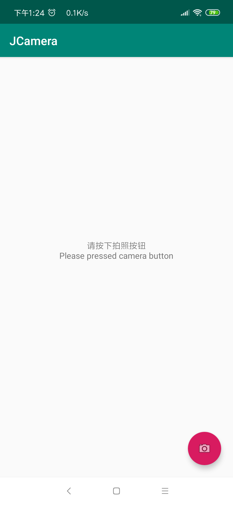
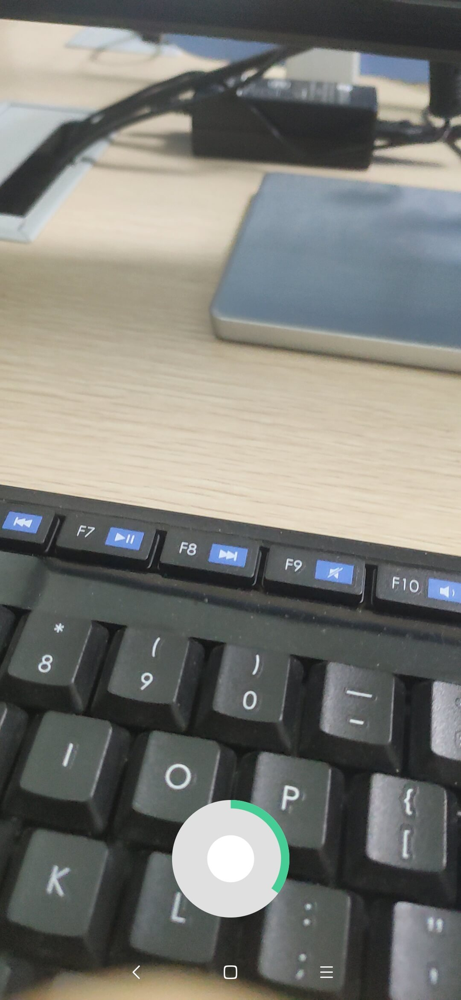
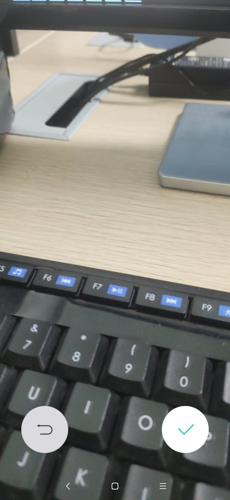
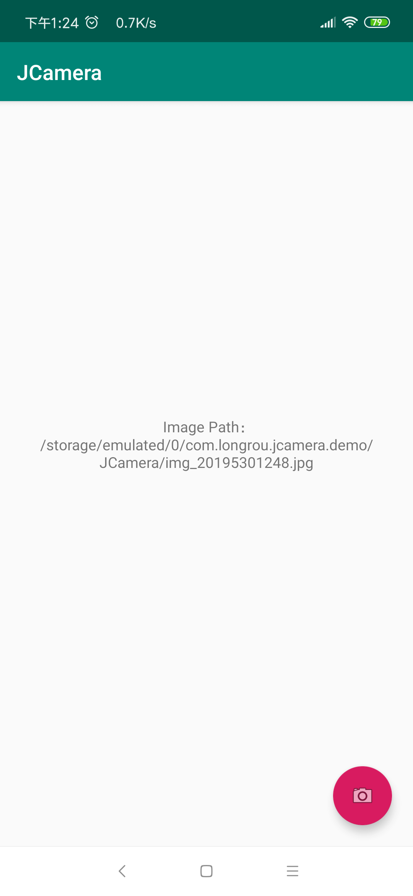

# JCamera
[](http://developer.android.com/index.html)

[](https://android-arsenal.com/api?level=21)

This is Android CameraActivity,Imitation WeChat Camera

Android 仿微信视频拍摄 支持触摸拍摄 长按拍摄，采用camera2，需要API>21 后续考虑支持API>18

解决前置摄像头镜像问题，视频压缩采用了MasayukiSuda 的 https://github.com/MasayukiSuda/Mp4Composer-android  ，会在原视频输出后占用600-700ms压缩及旋转视频

支持一步调用 支持AndroidX 本库自身支持6.0+自主动态获取权限 以及 7.0+provider配置

### JPG
<table>
    <td></td>
    <td></td>
    <td></td>
    <td></td>
</table>

### GIF
<table>
    <td><br>视频拍摄<br>video</td>
    <td><br>图片拍摄<br>photo</td>
</table>

### Demo

扫码下载
<br>
<a href="art/app-debug.apk">点击下载</a>

## Version
2018-8-13 V1.0.1 优化尺寸匹配算法，多摄像头匹配，解决华为设备崩溃
<br>
2018-5-30 V1.0.0

## Gradle
Step 1. Add the JitPack repository to your build file
```groovy
allprojects {
	repositories {
		...
		maven { url 'https://jitpack.io' }
	}
}
```
Step 2. Add the dependency
```groovy
dependencies {
        implementation 'com.github.jxj2118:JCamera:v1.0.0'
}

```
Step 3. Need Open DataBinding (PS. Follow-up consideration remove)
```groovy
android {
        ...
        dataBinding {
                enabled true
        }
}
```

## Usage

### Open CameraActivity
```
    //如不设置 会默认打开上一次配置的结果
        JCamera.instance
            //.openPreCamera()// 是否打开为前置摄像头
            .allowPhoto(true)// 是否允许拍照 默认允许
            .allowRecord(true)// 是否允许录像 默认允许
            .setMaxRecordTime(3)//最长录像时间 秒
            .start(this,PHOTO_OR_VIDEO_FOR_CAMERA)//PHOTO_OR_VIDEO_FOR_CAMERA 请求码 回调时可用
```

### Capture Rusult
```
    override fun onActivityResult(requestCode: Int, resultCode: Int, data: Intent?) {
            super.onActivityResult(requestCode, resultCode, data)
            if (resultCode == Activity.RESULT_OK &&  requestCode == PHOTO_OR_VIDEO_FOR_CAMERA){
                data?.let {
                    // JCamera.resultIsImg(data) 返回是否为图片
                    if (JCamera.resultIsImg(data)){
                        // JCamera.getResultPath(data) 获取结果路径
                        text.text = "Image Path：\n${JCamera.getResultPath(data)}"
                    }else{
                        text.text = "Video Path：\n${JCamera.getResultPath(data)}"
                    }
                }
            }
        }
```

## Builder Method
| method | description |
|:---|:---|
| openPreCamera | 打开前置摄像头，默认打开上一次打开的摄像头 |
| setMaxRecordTime | 最大录制时间，单位 秒 |
| allowRecord | 是否允许录像 |
| allowPhoto | 是否允许拍照 |

PS. 所有设置 会默认打开上一次配置的结果

## References And Special Thanks to
* [Mp4Composer-android](https://github.com/MasayukiSuda/Mp4Composer-android)
* [android-Camera2Video](https://github.com/googlesamples/android-Camera2Video)

## License

[MIT License](https://github.com/jxj2118/JCamera/blob/master/LICENSE)
