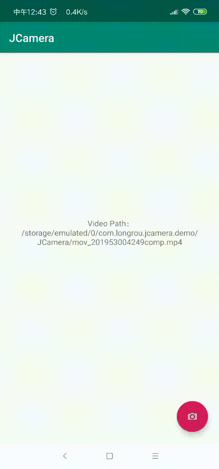

# JCamera

This is Android CameraActivity,Imitation WeChat Camera

Android 仿微信视频拍摄 支持触摸拍摄 长按拍摄，采用camera2，需要API>21 后续考虑支持API>18

解决前置摄像头镜像问题，视频压缩采用了MasayukiSuda 的 https://github.com/MasayukiSuda/Mp4Composer-android  ，会在原视频输出后占用600-700ms压缩及旋转视频

支持一步调用

<table>
    <td> 视频拍摄 video</td>
    <td> 图片拍摄 photo</td>
</table>

## Gradle
